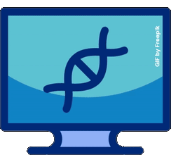

# About me 

Master's student [@IST](https://tecnico.ulisboa.pt/en/). Executive producer and gameplay programmer [@GameDev Técnico](https://gamedev.tecnico.ulisboa.pt).

My main interests include machine learning, information visualization, game design, and general backend development.

A lot of my projects are here, for posterity.

## ⚙️ Technology I've Used

Note: The list is always growing, because I'm always learning. If I'm unfamiliar with a new tool I need - well, that's what research is for!

### Technology directly related to implementation

<table>
<tr>
  <th>Domain</th>
  <th>Technology</th>
</tr>
<tr>
  <td>Backend programming</td>
  <td>
     
    
    
    
    
  </td>
</tr>
<tr>
  <td>Web application development</td>
  <td>
     
     
  </td>
</tr>
<tr>
  <td>Frontend development</td>
  <td>
     
     
    
  </td>
</tr>
<tr>
  <td>Database management</td>
  <td>
     
     
  </td>
</tr>
<tr>
  <td>Data analysis and integration</td>
  <td>
     
     
     
     
     
     
    
  </td>
</tr>
<tr>
  <td>Gameplay programming</td>
  <td>
     
     
     
  </td>
</table> 

### Miscellaneous tools

 

<table>
<tr>
  <th>Domain</th>
  <th>Technology</th>
</tr>
<tr>
  <td>Source control</td>
  <td>
     
     
  </td>
</tr>
<tr>
  <td>Task management</td>
  <td>
     
     
     
  </td>
</tr>
<tr>
  <td>Team brainstorming</td>
  <td>
     
     
  </td>
</tr>
<tr>
  <td>Application design (backend, frontend)</td>
  <td>
     
     
     
  </td>
</tr>
</table>

## 💡 Projects

#### Domains
1. [Data Analysis](#data-analysis)
2. [Artificial Intelligence and Machine Learning](#ai-and-ml)
3. [User-Centered Design](#design)
4. [Software and Network Security](#security)
5. [Software Development (Misc.)](#misc)

 Work Details 

### 1. [Domain: Data Analysis](#domains)

<table>
  <th>Project</th>
  <th>Technology Used</th>
  <th>Work Summary</th>
</table>

### 2. [Domain: Artificial Intelligence and Machine Learning](#domains)

<table>
  <th>Project</th>
  <th>Technology Used</th>
  <th>Work Summary</th>
</table>

### 3. [Domain: User-Centered Design](#domains)
<table>
  <th>Project</th>
  <th>Technology Used</th>
  <th>Work Summary</th>
</table>

### 4. [Domain: Software and Network Security](#domains)
<table>
  <th>Project</th>
  <th>Technology Used</th>
  <th>Work Summary</th>
</table>

### 5. [Domain: Software Development (Misc.)](#domains)

<table>
  <th>Project</th>
  <th>Technology Used</th>
  <th>Work Summary</th>
</table>

